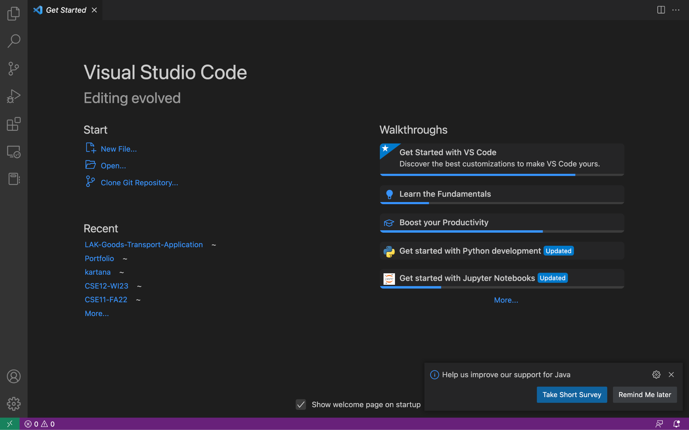
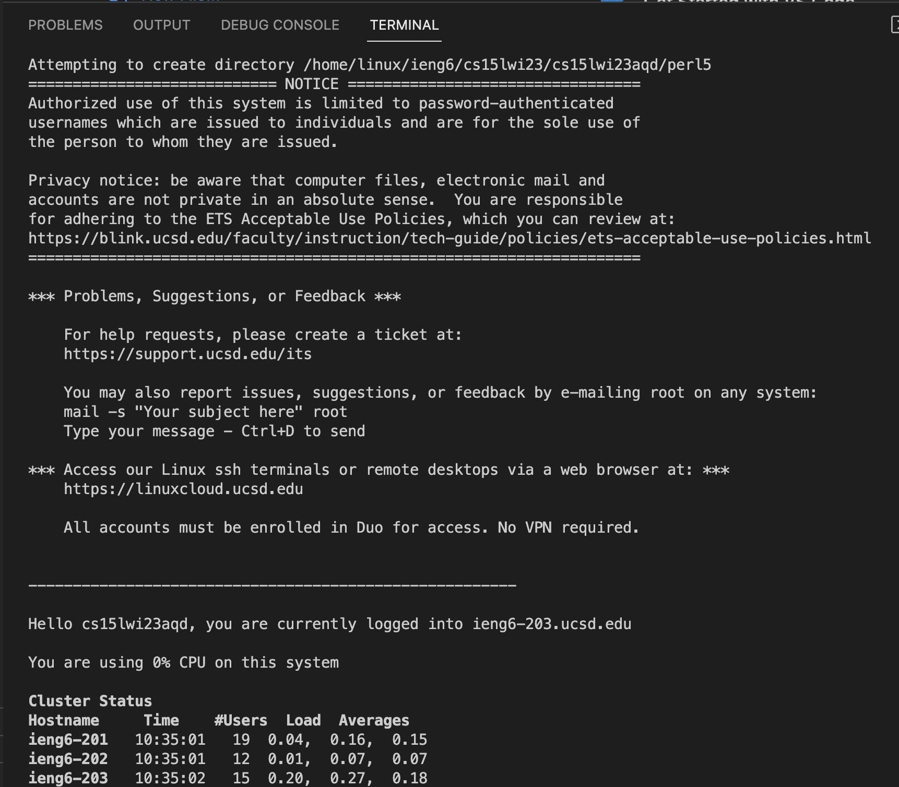
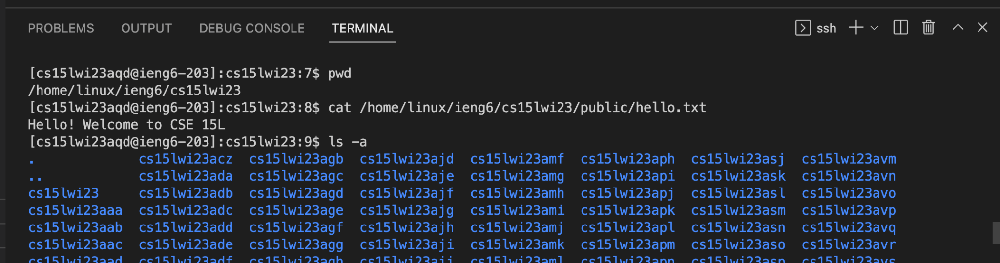

# Week 1 Lab Report: Remote Access
  
Hello CSE 15L students! In this blog post, I will guide you through how to log into a course-specific account on `ieng6`.

<br>

## Step 1: Installing Visual Studio Code

The first step is to install VSCode on your computer. You can do this by going to [https://code.visualstudio.com/](https://code.visualstudio.com/) and clicking Download in the top right corner. Make sure you select the correct version for your operating system.

Open VSCode once it's downloaded, and you should see something like this


<br>

## Step 2: Remotely Connecting

This section is a walk-through of using VSCode/terminal to connect to a remote computer in the CSE basement over the Internet.

For Windows users only: install `git` for Windows [here](https://gitforwindows.org/) then follow [this tutorial](https://stackoverflow.com/questions/42606837/how-do-i-use-bash-on-windows-from-the-visual-studio-code-integrated-terminal/50527994#50527994) to use Bash on Windows

Open a VSCode terminal (Ctrl or Command + `, or Terminal → New Terminal through the menu) and type in the following command: 
```
$ ssh cs15lwi23zz@ieng6.ucsd.edu
```
**Note:** The `$` is just a convention and isn't actually part of the command

Since this is your first time connecting to this server, it should give you the following message:
```
The authenticity of host 'ieng6.ucsd.edu (128.54.70.227)' can't be established.
RSA key fingerprint is SHA256:ksruYwhnYH+sySHnHAtLUHngrPEyZTDl/1x99wUQcec.
Are you sure you want to continue connecting (yes/no/[fingerprint])?
```
Enter `yes`, then enter your password, and you should see something like this:


<br>

## Step 3: Trying Some Commands

Now you are ready to run some commands! Here are some useful ones you can try:

* `cd`
* `ls`
* `pwd`
* `mkdir`
* `cp`

Here are some examples:


* The `pwd` command prints the working directory.
* The `cat` command prints the content from one or more files.
* The `ls` command lists files and subdirectories in the current directory. You can add arguments like `-a`, which will list all the hidden ones as well.

<br>

You are now fully set up. Good luck on the rest of your 15L journey!
