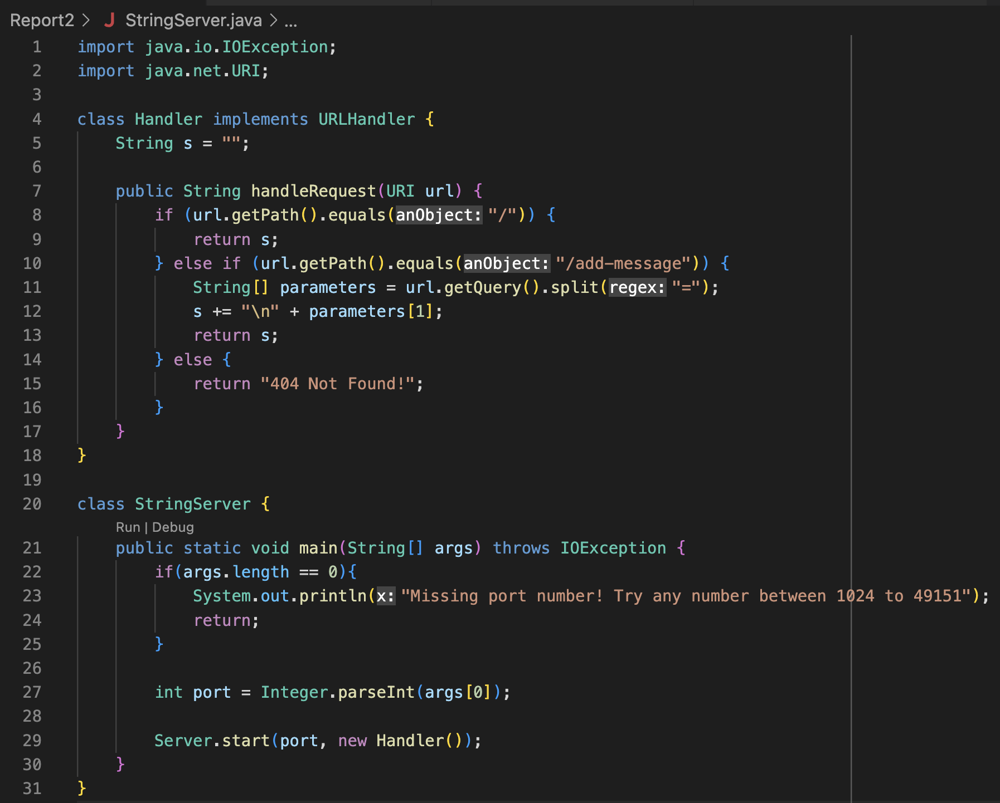

# Week 3 Lab Report: Servers and Bugs

## Part 1

The following is a screenshot of the code for my `StringServer`



<br>

Here are two examples of using `/add-message`


* The method `handleRequest` is called with the argument `new URI("localhost:4000/add-message?s=Hello")`
* The String `s` changed from the empty string `""` to `"\nHello"` after this request

<br>


* The method `handleRequest` is called with the argument `new URI("localhost:4000/add-message?s=How%20are%20you%20")`
* The String `s` changed from `"\nHello"` to `"\nHello\nHow are you"` after this request

<br>

## Part 2

In lab 3, there was a bug in the `merge` method in ListExamples.java.

<br>

This is an example of a failure-inducing input for the buggy program
```
@Test
    public void testMerge() {
        String[] input1Array = {"a", "a", "c"};
        List<String> input1 = Arrays.asList(input1Array);
        String[] input2Array = {"d", "z", "z"};
        List<String> input2 = Arrays.asList(input2Array);
        String[] expectedArray = {"a", "a", "c", "d", "z", "z"};
        List<String> expected = Arrays.asList(expectedArray);
        List<String> actual = ListExamples.merge(input1, input2);
        assertEquals(expected, actual);
    }
```
Here is the symptom of this failed test


<br>

This is an example of an input that doens't induce a failure
```
@Test
public void testMergeEmpty() {
    List<String> input1 = new ArrayList<>();
    List<String> input2 = new ArrayList<>();
    List<String> expected = new ArrayList<>();
    List<String> actual = ListExamples.merge(input1, input2);
    assertEquals(expected, actual);
}
```
Here is the output of running this test


<br>

In the last while loop of the `merge` method, there was a line that said
```
index1 += 1;
```
instead of
```
index2 += 1;
```

Changing this line fixes the issue because initially, the code incremented index1 instead of index2. This caused the while loop to be always true, resulting in an infinite loop. 

<br>

## Part 3

My most important takeaway is the importance of testing your code thoroughly. It's not always obvious that your program has a bug because a bug won't result in an error in every single test case. Sometimes you may write a few test cases that all pass, but there could be a few edge cases that you didn't consider.