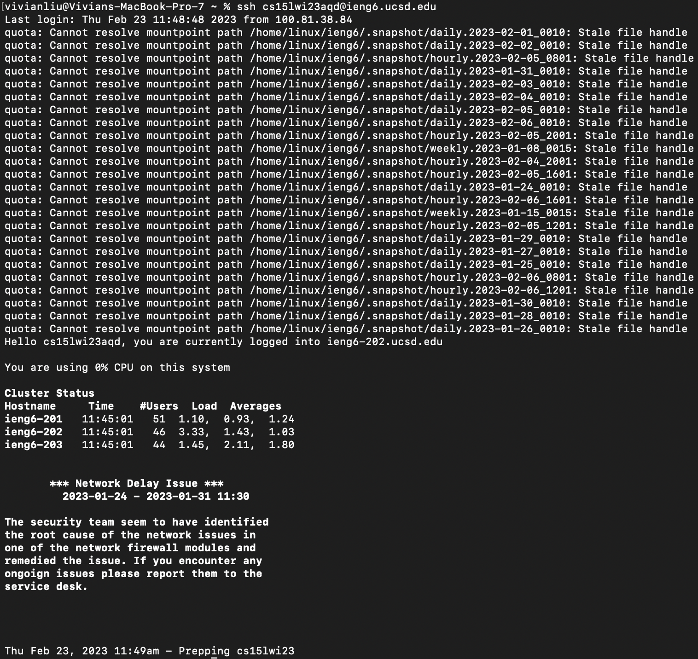
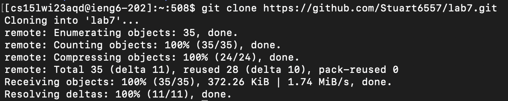
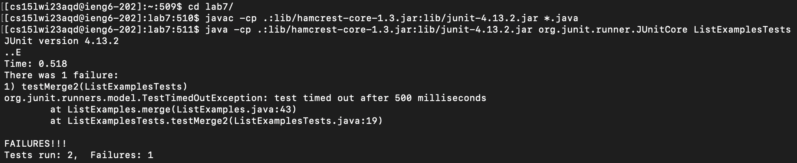
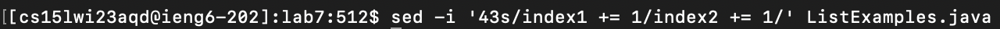
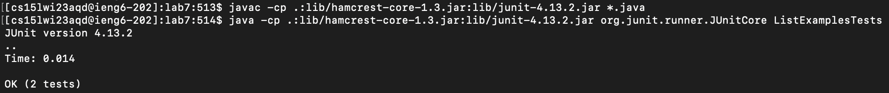
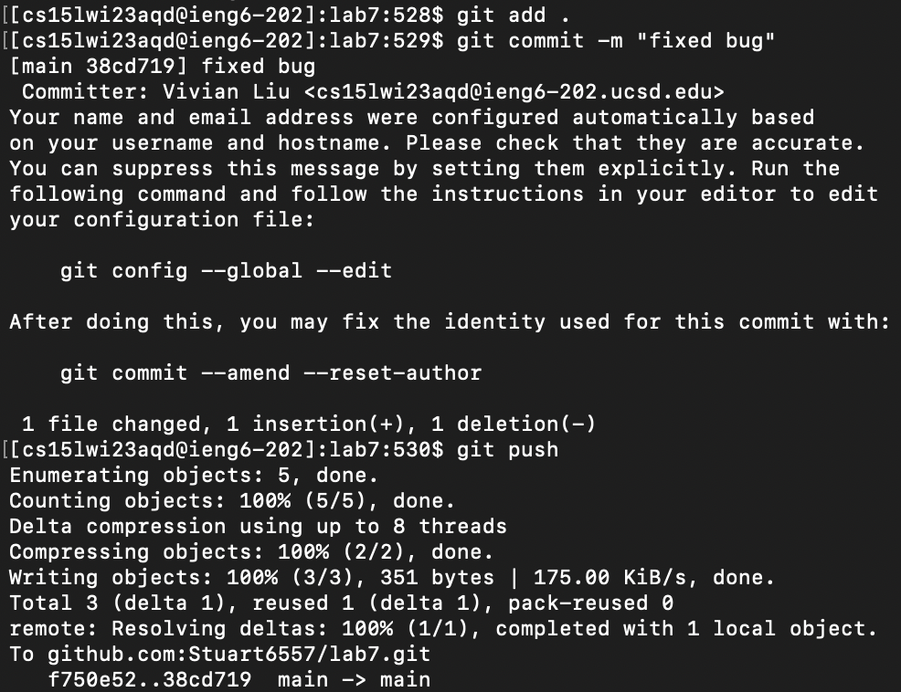

# Week 7 Lab Report: Competition Task

## 1. Log into ieng6

Keys pressed: `<up><enter>`

The `ssh cs15lwi23aqd@ieng6.ucsd.edu` command was 1 up in my history, so I pressed `<up>` to access it.

 

## 2. Clone your fork of the repository from your Github account

Keys pressed: `git clone <Cmd+V><enter>`

I copied the clone url from GitHub, so I used `<Cmd+V>` to paste it.

 

## 3. Run the tests, demonstrating that they fail

Keys pressed: `cd l<tab><enter>`, `<Cmd+V><enter>`, `<Cmd+V>L<tab>T<tab><backspace><enter>`

Pressing `<tab>` autocompleted `lab7/` because it was the only repo that started with `L`. I pressed `<enter>` to run the `cd` command to navigate into the `lab7/` directory, and then pasted the `javac -cp .:lib/hamcrest-core-1.3.jar:lib/junit-4.13.2.jar *.java` command with `<Cmd+V>`. I pressed `<enter>` again to run this command to compile the files, and pasted `java -cp .:lib/hamcrest-core-1.3.jar:lib/junit-4.13.2.jar org.junit.runner.JUnitCore ` with `<Cmd+V>`. Typing `L` and `<tab>` autocompleted it to `ListExamples`, and typing `T` and `<tab>` autocompleted it to `ListExamplesTests.`. Since I didn't need the `.`, I typed `<backspace>` and then pressed `<enter>` to run the tests.

 

## 4. Edit the code file to fix the failing test

Keys pressed: `sed -i '43s/index1 += 1/index2 += 1/' L<tab>.j<tab><enter>`

I used this stream editor command to edit the buggy code in `ListExamples.java`. The first `<tab>` autocompletes it to `ListExamples`, so I then typed `.j<tab>` to complete the file name.

 

## 5. Run the tests, demonstrating that they now succeed

Keys pressed: `<up><up><up><enter>`, `<up><up><up><enter>`

The `javac -cp .:lib/hamcrest-core-1.3.jar:lib/junit-4.13.2.jar *.java` command was 3 up in my history, so I pressed `<up>` 3 times to access it. Likewise, the `java -cp .:lib/hamcrest-core-1.3.jar:lib/junit-4.13.2.jar org.junit.runner.JUnitCore ListExamplesTests` command was 3 up in my history, so I pressed `<up>` 3 times to access it.

 

## 6. Commit and push the resulting change to your Github account

Keys pressed: `git add .<enter>`, `git commit -m "fixed bug"<enter>`, `git push<enter>`

These commands add, commit, and push all changes to my GitHub account.

